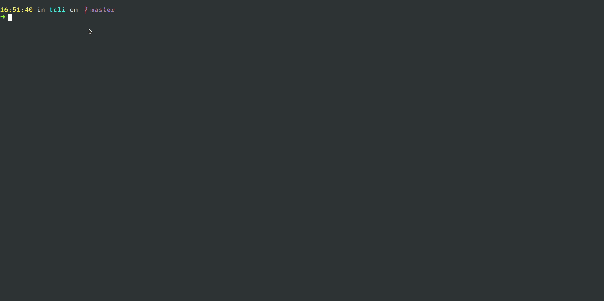

# tcli


> An interactive Trello client with auto-completion feature



Available features:

- [x] `ls` command to show boards, lists, cards and comments
- [x] `cat` command to show more info on boards, lists, cards and comments
- [x] `cd` command to navigate through the Trello hierarchy (`boards > lists > cards > comments`)
- [x] `cp` command to copy cards and comments
- [x] `touch` command to create new cards and comments
- [x] `mv` command to move cards
- [x] `edit` command to create or edit cards and comments
- [x] `rm` command to archive cards and delete comments
  - [x] `rm /board/list/*` command to archive all cards in list

You can also integrate OS commands with a pipe (`|`) after the TCli command:

```bash
# to read long descriptions or comments for example
/> cat /board/list/card | less
# everything after the pipe are used as your OS execution
# e.g. using grep to filter out some keywords
/> cat /board/list/card | grep some-keywords
# or using multiple pipes
/> cat /board/list/card | sed "s/word-to-replace/replaced-word/g" | less
# you can also redirect the output
/> cat /board/list/card | sed "s/word-to-replace/replaced-word/g" > /tmp/output
```

## Installation
### Downloading standalone binary

Binaries are available from [Github releases](https://github.com/l-lin/tcli/releases).

### Using cURL

```bash
curl -sf https://gobinaries.com/l-lin/tcli | sh
```

### Using docker

```bash
docker run -it --rm -v /path/to/.tcli.yml:/.tcli.yml ghcr.io/l-lin/tcli
```

### Building from source

```bash
# Build
make compile
```

## Usage

```bash
# explore the CLI with the help command
tcli -h

# start interactive mode
tcli

# you can also use it as a CLI
tcli ls /
```

## Configuration

A `.tcli.yml` will be generated at first execution. Its content is as follows:

```yaml
trello:
  # access token generated from first usage
  access_token: xxx
  # the Trello developer API key 
  api_key: yyy
  # Trello base API URL
  base_url: https://trello.com/1
# OS command used to edit the Trello resources
editor: editor
```

## Inspiration

I'm mostly using the command line, and I like using VIM to edit contents. The Trello web UI is great, but I prefer
staying in the terminal. I could not find some good CLI / prompt, hence this project was born.

tcli was inspired by [trelew](https://github.com/fiatjaf/trelew) and unix commands, for their APIs are quite neat and
really powerful. Although the meaning of the commands do not really reflect the actions on the Trello resources, it's
still quite similar if we consider boards and lists as directories, and cards as files, thus avoiding the burden of
learning new commands.
